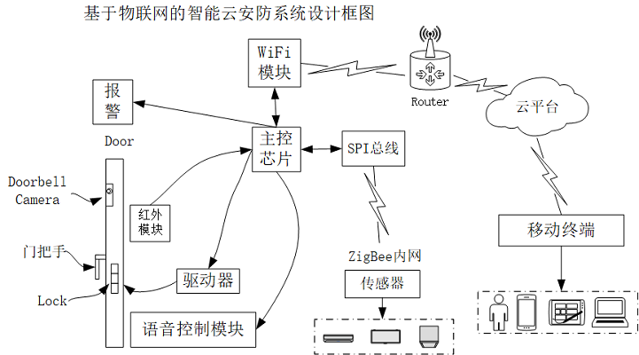

基于树莓派的智能云安防系统
=============
## 系统框图

    本系统是基于物联网的云安防系统，使用树莓派作为本地服务器，连接zigbee网络采集传感器信息，接入音频模块与视频模块采集音视频信号，帮助用户时刻掌握家庭安全状态。软件部分主要由Python和C语言完成。Python语言负责完成主要的逻辑功能，C语言主要用于编写web服务器CGI处理程序。

   

   

  

## 基本防盗报警功能：

    系统开启，系统初始化完毕，检测动作的程序后台运行，同时系统开机自动处于安全模式绿灯亮，这时输入密码1993系统由安全模式切换为警戒模式，感应器感应到人体动作发生，发出提示应，要求输入密码解除警报，若输入正确密码，则系统进入安全模式。若输入错误密码，系统进行报警，抓拍当事人照片上传到yeelink云端，发送警报邮件通知用户。同时本系统开机后便时刻检测室内烟雾状态，当超过临界值之后有发生火灾的危险时便会自动发生警报信号，通知主人。
这一部分中使用python完成，主要工作就是使用python完成信息采集工作，切换系统指示灯的显示，通过串口收集yeelink网络传感器数据。借助python参考yeelink的API开发文档完成信息到云端的上传工作。

## 语音识别功能：
    
首先上述过程中防盗报警系统安全模式与警戒模式的切换均是输入密码完成的，这一部分的功能为我们扩展了通过语音命令进入或者离开警戒模式的功能。
    除了语音控制报警系统之外，本系统仍扩展了一些对于日常生活十分实用的功能。诸如通过语音命令去打开关闭风扇，通过语音命令查看室内温湿度状况以及当前居住地的天气信息，播放音乐等。
    例如：发出语音命令“小派，警戒” 本系统就会自动切换进入警戒模式。
          发出语音命令 “小派，开灯” 本系统就会自动为用户打开灯泡。
	这一部分是使用python编写完成的，通过事先在系统中建立语音识别环境，使用python开发语音识别插件，来完成我们系统中所具有的各项语音命令。

## Yeelink云

    本系统的云端使用功能丰富的yeelink云作为信息存储显示和控制云平台。我们可以将系统收集到的各种数字信息图片信息上传到云端保存并图表化的提供给用户查看，同时提供开关控制功能，用户无论是使用PC还是使用移动终端都可以通过云端对家庭信息了如指掌，便捷操控。
这一部分使用python完成了温湿度数据以及图片的上传并在云端以坐标图的形式展示出来，通过python程序向云端请求开关状态数据完成了led灯和风扇的控制。本地系统与云端的双向数据通信过程都有体现。

## 本地web管理

    本地系统中在移植了嵌入式webserver用于对设备进行网络管理，通过访问服务器IP地址，浏览器网页部分部分主要实现了对于系统信息的简单配置以及室内信息的本地展示功能。同时也实现了当前摄像头所拍摄到的监控画面的查看。
这一部分主要解除C语言完成CGI处理程序编写，响应网页各种不同类型的请求，网页部分利用html，css以及javascript完成。